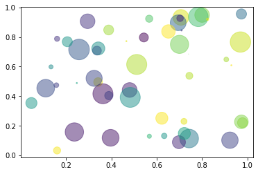

## Heading 1 - text and sample python code

Text underneath heading. Shift L shows lines


```python
# example code 1
example_integer = 3

def example_function(x):
    return x+3

example_function(example_integer)
```

## Heading 2 - markdown link

Text underneath heading 2. [sample link to google](www.google.com)

## Heading 3 - matplotlib chart

Text underneath heading 3


```python
# https://matplotlib.org/3.3.3/gallery/shapes_and_collections/scatter.html#sphx-glr-gallery-shapes-and-collections-scatter-py
%matplotlib inline
import numpy as np
import matplotlib.pyplot as plt

# Fixing random state for reproducibility
np.random.seed(19680801)


N = 50
x = np.random.rand(N)
y = np.random.rand(N)
colors = np.random.rand(N)
area = (30 * np.random.rand(N))**2  # 0 to 15 point radii

plt.scatter(x, y, s=area, c=colors, alpha=0.5)
plt.show()
```





## Heading 4 - image via markdown

Inserting image with markdown


## Heading 5 - image via html

Inserting image with markdown


## Heading 6 - plotly via json file


```python
#https://plotly.com/python/candlestick-charts/
import plotly.graph_objects as go

import pandas as pd
from datetime import datetime

df = pd.read_csv('https://raw.githubusercontent.com/plotly/datasets/master/finance-charts-apple.csv')

fig = go.Figure(data=[go.Candlestick(x=df['Date'],
                open=df['AAPL.Open'],
                high=df['AAPL.High'],
                low=df['AAPL.Low'],
                close=df['AAPL.Close'])])

fig.write_json('plotlychart.json')
```

 

## Heading 7 - pandas table

Text underneath heading 7


```python
import yfinance as yf
import plotly.graph_objects as go
import pandas as pd
#from datetime import datetime
ticker = 'BTC-USD' #'TSLA'#
stock_data = yf.Ticker(ticker)

#is this adjusted?
ohlc = stock_data.history(period="max").drop(columns=['Dividends','Stock Splits'])
ohlc["EMA(50d)"] = ohlc["Close"].ewm(span=50).mean()
ohlc["EMA(200d)"] = ohlc["Close"].ewm(span=200).mean()
# need to work out how to add without affeting next step
ohlc.tail()
```


<div>
<style scoped>
    .dataframe tbody tr th:only-of-type {
        vertical-align: middle;
    }

    .dataframe tbody tr th {
        vertical-align: top;
    }

    .dataframe thead th {
        text-align: right;
    }
</style>
<table border="1" class="dataframe">
  <thead>
    <tr style="text-align: right;">
      <th></th>
      <th>Open</th>
      <th>High</th>
      <th>Low</th>
      <th>Close</th>
      <th>Volume</th>
      <th>EMA(50d)</th>
      <th>EMA(200d)</th>
    </tr>
    <tr>
      <th>Date</th>
      <th></th>
      <th></th>
      <th></th>
      <th></th>
      <th></th>
      <th></th>
      <th></th>
    </tr>
  </thead>
  <tbody>
    <tr>
      <th>2021-01-13</th>
      <td>33915.121094</td>
      <td>37599.960938</td>
      <td>32584.667969</td>
      <td>37316.359375</td>
      <td>69364315979</td>
      <td>26998.719244</td>
      <td>17341.674031</td>
    </tr>
    <tr>
      <th>2021-01-14</th>
      <td>37325.109375</td>
      <td>39966.406250</td>
      <td>36868.562500</td>
      <td>39187.328125</td>
      <td>63615990033</td>
      <td>27476.703906</td>
      <td>17559.043724</td>
    </tr>
    <tr>
      <th>2021-01-15</th>
      <td>39156.707031</td>
      <td>39577.710938</td>
      <td>34659.589844</td>
      <td>36825.367188</td>
      <td>67760757880</td>
      <td>27843.318153</td>
      <td>17750.748435</td>
    </tr>
    <tr>
      <th>2021-01-16</th>
      <td>36821.648438</td>
      <td>37864.367188</td>
      <td>35633.554688</td>
      <td>36178.140625</td>
      <td>57706187875</td>
      <td>28170.173936</td>
      <td>17934.105571</td>
    </tr>
    <tr>
      <th>2021-01-17</th>
      <td>35000.664062</td>
      <td>36638.953125</td>
      <td>34069.320312</td>
      <td>35200.972656</td>
      <td>58217975808</td>
      <td>28445.891533</td>
      <td>18105.915194</td>
    </tr>
  </tbody>
</table>
</div>


```python
import plotly.graph_objects as go
import pandas as pd

fig = go.Figure(data=[go.Table(
    header=dict(values=list(ohlc.columns),
                fill_color='paleturquoise',
                align='left'),
    cells=dict(values=[ohlc.Open, ohlc.High, ohlc.Low, ohlc.Close, ohlc['Volume'], ohlc['EMA(50d)'], ohlc['EMA(200d)']],
               fill_color='lavender',
               align='left'))
])

fig.write_json('table.json')
```

 


```python
agg_dict={'Open': 'first',
          'High': 'max',
          'Low': 'min',
          'Close': 'last',
          'Volume': 'sum'}

weekly_ohlc = ohlc.resample('W-FRI').agg(agg_dict)

weekly_ohlc["EMA(10w)"] = weekly_ohlc["Close"].ewm(span=10).mean()
weekly_ohlc["EMA(35w)"] = weekly_ohlc["Close"].ewm(span=35).mean()

up_colour = '#3d9970' #default up / '#0080ff' is #bloomberg blue
down_colour = '#ff4136' #default down
#set up three themes? camdefault/tradethetape, yahoo, bloomberg?

candlestick = go.Candlestick(
    x=weekly_ohlc.index,
    open=weekly_ohlc['Open'],
    high=weekly_ohlc['High'],
    low=weekly_ohlc['Low'],
    close=weekly_ohlc['Close'],
    name = f'Last Price {weekly_ohlc["Close"][-1]:.2f}',
    yaxis='y2',
    increasing_line_color=up_colour,
    decreasing_line_color=down_colour
)

volume = go.Bar(
    x=weekly_ohlc.index, 
    y=weekly_ohlc['Volume'],
    yaxis='y',
    name=f'Volume {weekly_ohlc["Volume"][-1]/1000000:.1f}M',
    marker_color = [down_colour if close_minus_open < 0 else up_colour for close_minus_open in (weekly_ohlc['Close']-weekly_ohlc['Open']).tolist()]
)

ema_short = go.Scatter(
    x=weekly_ohlc.index, 
    y=weekly_ohlc['EMA(10w)'],
    mode='lines',
    name=f'EMA(10w) {weekly_ohlc["EMA(10w)"][-1]:.2f}',
    line_color ='red',
    yaxis='y2'
)

ema_long = go.Scatter(
    x=weekly_ohlc.index, 
    y=weekly_ohlc['EMA(35w)'],
    mode='lines',
    name=f'EMA(35w) {weekly_ohlc["EMA(35w)"][-1]:.2f}',
    line_color ='blue',
    yaxis='y2'
) 

layout = go.Layout(
    template='seaborn', #plotly_dark
    title = {'text': stock_data.info['shortName'], 'font': {'size': 18}},
    yaxis = {'side': 'left', 'domain': [0, 0.2], 'showticklabels': False},
    yaxis2 = {'title': f'Price ({stock_data.info["currency"]})', 'side':'right', 'domain': [0.2,  1]}, #'type': 'log', 
    hovermode='x unified',
    width=1000, height=600,
    legend = {'yanchor': 'top', 'y': 0.99, 'xanchor': 'left', 'x': 0.01},
    xaxis= {
        'range': [weekly_ohlc.index[-70], weekly_ohlc.index[-1]+(weekly_ohlc.index[-1]-weekly_ohlc.index[-2])], #default range - 70 bars adds space on right
        'rangeslider': {'visible': False},
        'rangeselector':{'buttons': [{
            'label': '1M', 'step': 'month', 'count': 1, 'stepmode': 'backward'},
            {'label': '6M', 'step': 'month', 'count': 6, 'stepmode': 'backward'},
            {'label': '1Y', 'step': 'year', 'count': 1, 'stepmode': 'backward'},
            {'label': '3Y', 'step': 'year', 'count': 3, 'stepmode': 'backward'},
            {'label': 'Max','step': 'all'}]}},
    #paper_bgcolor="LightSteelBlue",
    #utosize=True,
    margin=dict(l=60, r=60, b=60, t=75) #default seems to be 80,80,80,100
    #)
)

data = [candlestick, volume, ema_short, ema_long]
fig = go.Figure(data=data,layout=layout)

fig.write_json('candlestick.json')

#see subplots instead? can then do daily/weekly timescales?
# fix hover
```

 
