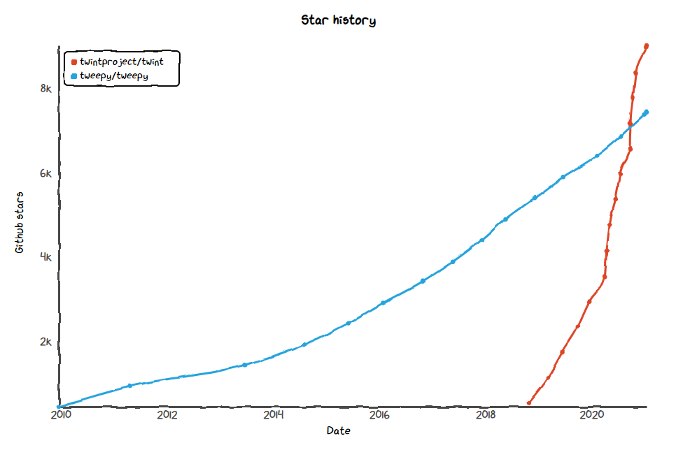



## TLDR

- Twitter data can be downloaded using Python libraries Twint and Tweepy. 
- Tweepy has more functionality but Twint doesn't restrict the amount of data that can be downloaded.
- Installation of Twint currently requires downloading from a specific repo.
- Twint can time out downloading larger datasets so a custom search loop provides better reliability.

## Some Background

Late last year I had a horrible time trying to buy online a Google Pixel 5 from Currys PC World, the UK's largest electrical retailer. For a limited time, the £600 phone came with a free set of Bose headphones worth £300 so I was keen to make the purchase and qualify for the bonus and I paid £10 extra for next day delivery. When the phone didn't arrive the next day and I hadn't heard anything, I rang Currys' customer service team to find out why.

Currys' customer service team is called Team Knowhow which is ironic considering every time I called they had absolutely no idea about anything to do with my order. Each time I called I would wait at least an hour on hold before someone would answer and give a different reason for what had happened and why my order hadn't been delivered. Each person would then tell me that someone else would call me back within 24-48 hours to resolve the issue, which of course never happened, forcing me to call back, wait on hold again and have the whole process repeat multiple times.

After a week of calling and still without a phone, I was frustrated and searched online for other ways to contact Team Knowhow. I first found an email address so I sent all my details but never got a reply. To be factually correct, I eventually did get a reply but it only arrived last week, 3 months after I had sent my email. 

I also found Team Knowhow's Twitter account which had lots of activity back and forth between customers and the Team Knowhow customer support team. I've had a Twitter account for years but apart from tweeting to enter the occasional competition, I've never really used it other than as a source of news and information. I noticed others having similar issues to me so I tweeted for help.



@TeamKnowhowUK replied nearly straight away and asked me to Direct Message them more information so they could look into it. Unfortunately it turned out the Team Knowhow service on Twitter wasn't any better than the Team Knowhow service via phone. After I sent them all the information, they would say they were looking into it and then never respond to any future messages sent via DM. Each time I followed up for an update my direct messages got ignored. I'd then tweet again publicly which would get an immediate response, again asking me to DM them my information which would then get ignored and the process would repeat.

I was more than frustrated and let them know how I felt.



To cut a long story short, there's some truth in the saying about the squeaky wheel getting the grease. After tweeting publicly a few times to highlight @TeamKnowhowUK's terrible customer service, there was eventually a happy ending when my new phone was delivered a few weeks late with a small gift voucher to apologise. I never received an explanation explaining the delay with my order but from other complaints I've read online, it looks like Currys' online store struggles to keep track of what's in stock and has a long history of selling out-of-stock items they can't deliver. Despite the happy ending I made a promise to myself that I'd never shop at Currys again.

## So what's this got to do with Downloading Twitter Data in Python?

Recently I've been experimenting with some sentiment analysis libraries in Python. Sentiment analysis, or opinion mining, refers to the use of natural language processing to systematically analyse large quantities of unstructured text and identify whether the text has positive, negative or neutral sentiment. 

Sentiment analysis is commonly used by businesses to conduct market research and analyse how products, competitors or customer support are perceived by the market. I've also read it's used by many quantitative hedge funds who have incorporated sentiment analysis into different trading strategies. I was keen to understand the process better to then see how I could use it in my own trading strategies.

A common source of data for sentiment analysis is Twitter which led me to experiment with some Python libraries used for downloading Twitter data. When looking for data to analyse, I remembered my experience with @TeamKnowhowUK and the negative sentiment I saw in a lot of the tweets from unhappy customers. I wondered whether the Python sentiment analysis libraries would report the same. But first I had to get the data!

## Python Libraries for Downloading Twitter Data - Tweepy vs Twint

To download data from Twitter there seems to be two main Python libraries  - [Tweepy](https://www.tweepy.org/) and [Twint](https://github.com/twintproject/twint).

I first started experimenting with Tweepy which uses Twitter's official API to access and download data. It requires you to apply to Twitter for developer access in order to get API keys but the process is relatively quick and painless. As the library has been around for over 10 years, the documentation is great and there are plenty of tutorials online for learning how to use the package. 

The main advantage of using Tweepy is that it uses the official Twitter API. This enables much more functionality than just downloading tweets. You can post tweets, block people, send DMs and write scripts to automatically retweet or follow back people who follow you. The biggest limitation of Tweepy is also that it uses the official Twitter API. The API limits the amount of data that can be downloaded and with the free account you are limited to downloading a few thousand tweets from within the last 7 days. This is great for obtaining recent data but for some of the trading ideas I want to explore, I would need tweet data going back further in history to for longer backtesting.

Twint is a much younger library and the documentation is somewhat minimal. It doesn't use the official Twitter API to obtain data but rather scrapes Twitter from public webpage addresses. Once you get it installed correctly (see my notes below), its performance seems to be close to Tweepy and I didn't notice much of a speed difference when downloading data. It's never going to be as fast as using the official API but its biggest advantage from not using the API is that you can effectively download tweets going back as far as you want, without any rate limitations.

Both libraries are popular and work well but Twint has recently taken the lead in Github stars, I assume from data hungry scientists looking to obtain tweet data older than the last 7 days.  



[Github Star History - Twint vs Tweep (https://star-history.t9t.io/#twintproject/twint&tweepy/tweepy)](https://star-history.t9t.io/#twintproject/twint&tweepy/tweepy "Github Star History - Twint vs Tweep")

## Installation of Twint

Despite online installation instructions advising a simple `pip install twint` to install Twint via PyPI's repository, I immediately ran into issues trying to use the library. It looked like Twitter had removed one of the endpoints that Twint used to make searches breaking functionality sometime in late 2020. 

Googling for solutions, I found the issue being discussed on [Twint's github repo](https://github.com/twintproject/twint/issues/915) and one of the contributors, Himanshu Dabas provided a workaround release that could be installed directly from Twint's github repo:

`pip install --upgrade git+https://github.com/twintproject/twint.git@origin/master#egg=twint`

Note if you are using Windows you'll also need Microsoft's C++ build tools to be installed.

To use Twint in Jupyter notebooks you also need to install nest asyncio by:

`pip install nest_asyncio`

## Downloading Data from Twitter using Twint

Before using Twint you need to import the twint and nest_asyncio libraries and then apply nest_asynicio to allow event loops to be nested. I've also imported some other libraries I use later on when analsying the data.


```python
# import required libraries
import twint
import nest_asyncio
nest_asyncio.apply()

import pandas as pd
pd.set_option('display.max_colwidth', None)
pd.set_option('display.max_columns', None)

import datetime as dt
from glob import glob
import os
```

Once everything is imported you need to specify your configuration parameters for the search function.

There's dozen of options that allow you to make searches as simple or complex as required. You can search for tweets containing a specific keyword or username and you can use combinations of multiple parameters to do complex searches such as finding tweets with a specific keyword that have more than 100 likes and were tweeted from a specific location on a specific date. 

There's also configuration options to specify how you want to store the results, whether that be in a JSON file, CSV or SQLite Database. 

A full set of configuration options can be found on [Twint's Github Wiki](https://github.com/twintproject/twint/wiki/Configuration).


```python
# twint configuration
c = twint.Config()

c.Search = 'teamknowhowuk'

c.Since = '2020-10-01 00:00:00' #"2020-10-01 00:00:00"
c.Until = '2020-11-01 00:00:00' #"2020-11-01 00:00:00"
 
c.Hide_output = True

c.Store_json = True
c.Output = '../data/raw/twint_search_data.json'
```

Above I used the 'since' and 'until' configuration paramaters to search for tweets in October 2020. Despite the docs saying otherwise, I found that the dates had to be passed in using the following format '%Y-%m-%d %H:%M:%S'.

I've also set Hide_output to True to hide the scraper showing each tweet as it searches which quickly fills up the window when doing the search in Jupyter notebooks.

Once you have specified the configuration paramaters, they can then be passed into the Search function.


```python
# run search
twint.run.Search(c)
```

    [!] No more data! Scraping will stop now.
    found 0 deleted tweets in this search.
    

The above search took 3 minutes to return 22000 tweets that matched my search parameters. For reference the JSON file is approx 22mb. 

The search time depends on your search parameters and I assume somewhat on your internet connection. For 22000 tweets I don't think 3 minutes it too bad.

Note if you run this search twice, it adds to the existing JSON rather than creating a new file. There must be a setting to create a new file but I couldn't find it in the docs.

## Analysing the Results

To view the results, I import the JSON file into a DataFrame using pandas. Note the lines parameter needs to be set to True.


```python
df =  pd.read_json('../data/raw/twint_search_data.json', lines = True)
df.shape
```


    (21773, 36)


Twint returns more or less the same data as Tweepy with the following columns.


```python
# view columns
df.columns
```


    Index(['id', 'conversation_id', 'created_at', 'date', 'time', 'timezone',
           'user_id', 'username', 'name', 'place', 'tweet', 'language', 'mentions',
           'urls', 'photos', 'replies_count', 'retweets_count', 'likes_count',
           'hashtags', 'cashtags', 'link', 'retweet', 'quote_url', 'video',
           'thumbnail', 'near', 'geo', 'source', 'user_rt_id', 'user_rt',
           'retweet_id', 'reply_to', 'retweet_date', 'translate', 'trans_src',
           'trans_dest'],
          dtype='object')


```python
# preview the data
df.head()
```


<div>
<style scoped>
    .dataframe tbody tr th:only-of-type {
        vertical-align: middle;
    }

    .dataframe tbody tr th {
        vertical-align: top;
    }

    .dataframe thead th {
        text-align: right;
    }
</style>
<table border="1" class="dataframe">
  <thead>
    <tr style="text-align: right;">
      <th></th>
      <th>id</th>
      <th>conversation_id</th>
      <th>created_at</th>
      <th>date</th>
      <th>time</th>
      <th>timezone</th>
      <th>user_id</th>
      <th>username</th>
      <th>name</th>
      <th>place</th>
      <th>tweet</th>
      <th>language</th>
      <th>mentions</th>
      <th>urls</th>
      <th>photos</th>
      <th>replies_count</th>
      <th>retweets_count</th>
      <th>likes_count</th>
      <th>hashtags</th>
      <th>cashtags</th>
      <th>link</th>
      <th>retweet</th>
      <th>quote_url</th>
      <th>video</th>
      <th>thumbnail</th>
      <th>near</th>
      <th>geo</th>
      <th>source</th>
      <th>user_rt_id</th>
      <th>user_rt</th>
      <th>retweet_id</th>
      <th>reply_to</th>
      <th>retweet_date</th>
      <th>translate</th>
      <th>trans_src</th>
      <th>trans_dest</th>
    </tr>
  </thead>
  <tbody>
    <tr>
      <th>0</th>
      <td>1322681186678964224</td>
      <td>1319301747744133120</td>
      <td>2020-10-31 23:25:43 GMT Standard Time</td>
      <td>2020-10-31</td>
      <td>23:25:43</td>
      <td>0</td>
      <td>82190632</td>
      <td>janierich21</td>
      <td>Jane Richard</td>
      <td></td>
      <td>@TeamKnowhowUK Still waiting for a new working code after 2 video calls, an email, a phone call and 3 online forms .......... what do you have to do to get some action before tomorrow’s deadline??????</td>
      <td>en</td>
      <td>[]</td>
      <td>[]</td>
      <td>[]</td>
      <td>0</td>
      <td>0</td>
      <td>0</td>
      <td>[]</td>
      <td>[]</td>
      <td>https://twitter.com/JanieRich21/status/1322681186678964224</td>
      <td>False</td>
      <td></td>
      <td>0</td>
      <td></td>
      <td></td>
      <td></td>
      <td></td>
      <td></td>
      <td></td>
      <td></td>
      <td>[{'screen_name': 'TeamKnowhowUK', 'name': 'Team Knowhow', 'id': '757984223898853376'}]</td>
      <td></td>
      <td></td>
      <td></td>
      <td></td>
    </tr>
    <tr>
      <th>1</th>
      <td>1322676071528075264</td>
      <td>1322483019664543744</td>
      <td>2020-10-31 23:05:24 GMT Standard Time</td>
      <td>2020-10-31</td>
      <td>23:05:24</td>
      <td>0</td>
      <td>154856846</td>
      <td>mrstuielooie</td>
      <td>Stuart</td>
      <td></td>
      <td>@TeamKnowhowUK @jamesco50333637 Can I use my in-store pre order for this?</td>
      <td>en</td>
      <td>[]</td>
      <td>[]</td>
      <td>[]</td>
      <td>0</td>
      <td>0</td>
      <td>0</td>
      <td>[]</td>
      <td>[]</td>
      <td>https://twitter.com/MrStuieLooie/status/1322676071528075264</td>
      <td>False</td>
      <td></td>
      <td>0</td>
      <td></td>
      <td></td>
      <td></td>
      <td></td>
      <td></td>
      <td></td>
      <td></td>
      <td>[{'screen_name': 'TeamKnowhowUK', 'name': 'Team Knowhow', 'id': '757984223898853376'}, {'screen_name': 'jamesco50333637', 'name': 'james couch', 'id': '1319586043453181952'}]</td>
      <td></td>
      <td></td>
      <td></td>
      <td></td>
    </tr>
    <tr>
      <th>2</th>
      <td>1322673832843452418</td>
      <td>1322520007306346496</td>
      <td>2020-10-31 22:56:30 GMT Standard Time</td>
      <td>2020-10-31</td>
      <td>22:56:30</td>
      <td>0</td>
      <td>1291450149751992322</td>
      <td>movie_goon</td>
      <td>MovieGoon</td>
      <td></td>
      <td>@TeamKnowhowUK That’s fine. I still have to part with £2500 for a PS5 for a well intentioned refund from a potential furloughed business. No thanks. I will wait for release date or a few weeks after</td>
      <td>en</td>
      <td>[]</td>
      <td>[]</td>
      <td>[]</td>
      <td>1</td>
      <td>0</td>
      <td>0</td>
      <td>[]</td>
      <td>[]</td>
      <td>https://twitter.com/movie_goon/status/1322673832843452418</td>
      <td>False</td>
      <td></td>
      <td>0</td>
      <td></td>
      <td></td>
      <td></td>
      <td></td>
      <td></td>
      <td></td>
      <td></td>
      <td>[{'screen_name': 'TeamKnowhowUK', 'name': 'Team Knowhow', 'id': '757984223898853376'}]</td>
      <td></td>
      <td></td>
      <td></td>
      <td></td>
    </tr>
    <tr>
      <th>3</th>
      <td>1322669702083170307</td>
      <td>1322669702083170304</td>
      <td>2020-10-31 22:40:05 GMT Standard Time</td>
      <td>2020-10-31</td>
      <td>22:40:05</td>
      <td>0</td>
      <td>388971911</td>
      <td>co_jo_al</td>
      <td>Corey A</td>
      <td></td>
      <td>@TeamKnowhowUK @curryspcworld how do I actually get in contact with someone? Your website is misleading as there is no actually contact details. I paid my deposit and now no code? What is going on!</td>
      <td>en</td>
      <td>[{'screen_name': 'curryspcworld', 'name': 'currys pc world', 'id': '170277278'}]</td>
      <td>[]</td>
      <td>[]</td>
      <td>1</td>
      <td>0</td>
      <td>0</td>
      <td>[]</td>
      <td>[]</td>
      <td>https://twitter.com/Co_Jo_Al/status/1322669702083170307</td>
      <td>False</td>
      <td></td>
      <td>0</td>
      <td></td>
      <td></td>
      <td></td>
      <td></td>
      <td></td>
      <td></td>
      <td></td>
      <td>[]</td>
      <td></td>
      <td></td>
      <td></td>
      <td></td>
    </tr>
    <tr>
      <th>4</th>
      <td>1322669399602507776</td>
      <td>1322664766851158016</td>
      <td>2020-10-31 22:38:53 GMT Standard Time</td>
      <td>2020-10-31</td>
      <td>22:38:53</td>
      <td>0</td>
      <td>383997206</td>
      <td>the_real_smz</td>
      <td>Samuel Marc Zelley</td>
      <td></td>
      <td>@JordanStevens92 @curryspcworld @TeamKnowhowUK I really hope so.</td>
      <td>en</td>
      <td>[]</td>
      <td>[]</td>
      <td>[]</td>
      <td>0</td>
      <td>0</td>
      <td>1</td>
      <td>[]</td>
      <td>[]</td>
      <td>https://twitter.com/the_real_sMz/status/1322669399602507776</td>
      <td>False</td>
      <td></td>
      <td>0</td>
      <td></td>
      <td></td>
      <td></td>
      <td></td>
      <td></td>
      <td></td>
      <td></td>
      <td>[{'screen_name': 'JordanStevens92', 'name': 'Jordan Stevens', 'id': '292506472'}, {'screen_name': 'curryspcworld', 'name': 'Currys PC World', 'id': '170277278'}, {'screen_name': 'TeamKnowhowUK', 'name': 'Team Knowhow', 'id': '757984223898853376'}]</td>
      <td></td>
      <td></td>
      <td></td>
      <td></td>
    </tr>
  </tbody>
</table>
</div>


From here it's easy to do basic analysis such as see who has tweeted the most, who has the most liked tweet or most retweets.


```python
# get top 10 most frequent usernames
df['username'].value_counts()[:10].sort_values(ascending=False)
```


    teamknowhowuk     11137
    lummy316            134
    greenwoodlini        90
    realdavemc           66
    mike_skinksy         56
    consuemer_sue        50
    yaboiwings__         45
    fryfive              41
    mosaab_02            39
    barrymcbride19       38
    Name: username, dtype: int64


## Searching within a Loop

I found when doing very large searches (such as searching for a whole year of tweets with a common keyword) often something would go wrong and the search function would time out/crash/freeze. The whole point of using Twint (over Tweepy) was to access large amounts of data and not be restricted by Twitter's API limits so having it time out on large searches was not ideal.

To avoid these issues I had better results searching one day at a time in a loop and then saving individual JSON files that could be imported and combined into one DataFrame. I was inspired by a similar approach i read on Stack Overflow or another blog but I didn't save the URL to give the author credit.

To search within a loop, first I create a function for the twint search and then another function to loop over the search function for each day in a date range. I also built in handling for the specific date format to make it easier to use.


```python
def twint_search(search_term, since, until, save_path):
    c = twint.Config()
    c.Search = search_term
    c.Lang = "en"
    c.Since = since.strftime('%Y-%m-%d %H:%M:%S')
    c.Until = until.strftime('%Y-%m-%d %H:%M:%S')
    c.Hide_output = True
    c.Store_json = True
    c.Output = save_path
    twint.run.Search(c)
    
def twint_search_loop(search_term, start_date, end_date, save_dir):
    try:
        os.makedirs(os.path.join(os.getcwd(),save_dir,search_term))
        print(f'Successfully created the directory {os.path.join(os.getcwd(),save_dir,search_term)}')
    except FileExistsError:
        print(f'Directory {os.path.join(os.getcwd(),save_dir,search_term)} already exists')
    
    date_range = pd.date_range(start_date, end_date)
    
    for single_date in date_range:
        since = single_date
        until = single_date + dt.timedelta(days=1)
        save_path = os.path.join(save_dir, search_term, f'{single_date:%Y%m%d}.json')
        print(f"Searching for tweets containing '{search_term}' from {single_date:%Y-%m-%d} and saving into {save_path}")
        twint_search(search_term, since, until, save_path)
```

Now to do a search, it's as easy as specifying the search term and the dates of interest. For example, to search for the same data as my initial search above:


```python
search_term = 'teamknowhowuk'
start_date = dt.datetime(2020, 10, 1)
end_date = dt.datetime(2020, 10, 31)
save_dir = '../data/raw/'

# run search
twint_search_loop(search_term, start_date, end_date, save_dir)
```

    Directory c:\Users\camer\Projects\twitter_sentiment\notebooks\../data/raw/teamknowhowuk already exists
    Searching for tweets containing 'teamknowhowuk' from 2020-10-01 and saving into ../data/raw/teamknowhowuk\20201001.json
    [!] No more data! Scraping will stop now.
    found 0 deleted tweets in this search.
    Searching for tweets containing 'teamknowhowuk' from 2020-10-02 and saving into ../data/raw/teamknowhowuk\20201002.json
    [!] No more data! Scraping will stop now.
    found 0 deleted tweets in this search.
    Searching for tweets containing 'teamknowhowuk' from 2020-10-03 and saving into ../data/raw/teamknowhowuk\20201003.json
    [!] No more data! Scraping will stop now.
    found 0 deleted tweets in this search.
    Searching for tweets containing 'teamknowhowuk' from 2020-10-04 and saving into ../data/raw/teamknowhowuk\20201004.json
    [!] No more data! Scraping will stop now.
    found 0 deleted tweets in this search.
    Searching for tweets containing 'teamknowhowuk' from 2020-10-05 and saving into ../data/raw/teamknowhowuk\20201005.json
    [!] No more data! Scraping will stop now.
    found 0 deleted tweets in this search.
    Searching for tweets containing 'teamknowhowuk' from 2020-10-06 and saving into ../data/raw/teamknowhowuk\20201006.json
    [!] No more data! Scraping will stop now.
    found 0 deleted tweets in this search.
    Searching for tweets containing 'teamknowhowuk' from 2020-10-07 and saving into ../data/raw/teamknowhowuk\20201007.json
    [!] No more data! Scraping will stop now.
    found 0 deleted tweets in this search.
    Searching for tweets containing 'teamknowhowuk' from 2020-10-08 and saving into ../data/raw/teamknowhowuk\20201008.json
    [!] No more data! Scraping will stop now.
    found 0 deleted tweets in this search.
    Searching for tweets containing 'teamknowhowuk' from 2020-10-09 and saving into ../data/raw/teamknowhowuk\20201009.json
    [!] No more data! Scraping will stop now.
    found 0 deleted tweets in this search.
    Searching for tweets containing 'teamknowhowuk' from 2020-10-10 and saving into ../data/raw/teamknowhowuk\20201010.json
    [!] No more data! Scraping will stop now.
    found 0 deleted tweets in this search.
    Searching for tweets containing 'teamknowhowuk' from 2020-10-11 and saving into ../data/raw/teamknowhowuk\20201011.json
    [!] No more data! Scraping will stop now.
    found 0 deleted tweets in this search.
    Searching for tweets containing 'teamknowhowuk' from 2020-10-12 and saving into ../data/raw/teamknowhowuk\20201012.json
    [!] No more data! Scraping will stop now.
    found 0 deleted tweets in this search.
    Searching for tweets containing 'teamknowhowuk' from 2020-10-13 and saving into ../data/raw/teamknowhowuk\20201013.json
    [!] No more data! Scraping will stop now.
    found 0 deleted tweets in this search.
    Searching for tweets containing 'teamknowhowuk' from 2020-10-14 and saving into ../data/raw/teamknowhowuk\20201014.json
    [!] No more data! Scraping will stop now.
    found 0 deleted tweets in this search.
    Searching for tweets containing 'teamknowhowuk' from 2020-10-15 and saving into ../data/raw/teamknowhowuk\20201015.json
    [!] No more data! Scraping will stop now.
    found 0 deleted tweets in this search.
    Searching for tweets containing 'teamknowhowuk' from 2020-10-16 and saving into ../data/raw/teamknowhowuk\20201016.json
    [!] No more data! Scraping will stop now.
    found 0 deleted tweets in this search.
    Searching for tweets containing 'teamknowhowuk' from 2020-10-17 and saving into ../data/raw/teamknowhowuk\20201017.json
    [!] No more data! Scraping will stop now.
    found 0 deleted tweets in this search.
    Searching for tweets containing 'teamknowhowuk' from 2020-10-18 and saving into ../data/raw/teamknowhowuk\20201018.json
    [!] No more data! Scraping will stop now.
    found 0 deleted tweets in this search.
    Searching for tweets containing 'teamknowhowuk' from 2020-10-19 and saving into ../data/raw/teamknowhowuk\20201019.json
    [!] No more data! Scraping will stop now.
    found 0 deleted tweets in this search.
    Searching for tweets containing 'teamknowhowuk' from 2020-10-20 and saving into ../data/raw/teamknowhowuk\20201020.json
    [!] No more data! Scraping will stop now.
    found 0 deleted tweets in this search.
    Searching for tweets containing 'teamknowhowuk' from 2020-10-21 and saving into ../data/raw/teamknowhowuk\20201021.json
    [!] No more data! Scraping will stop now.
    found 0 deleted tweets in this search.
    Searching for tweets containing 'teamknowhowuk' from 2020-10-22 and saving into ../data/raw/teamknowhowuk\20201022.json
    [!] No more data! Scraping will stop now.
    found 0 deleted tweets in this search.
    Searching for tweets containing 'teamknowhowuk' from 2020-10-23 and saving into ../data/raw/teamknowhowuk\20201023.json
    [!] No more data! Scraping will stop now.
    found 0 deleted tweets in this search.
    Searching for tweets containing 'teamknowhowuk' from 2020-10-24 and saving into ../data/raw/teamknowhowuk\20201024.json
    [!] No more data! Scraping will stop now.
    found 0 deleted tweets in this search.
    Searching for tweets containing 'teamknowhowuk' from 2020-10-25 and saving into ../data/raw/teamknowhowuk\20201025.json
    [!] No more data! Scraping will stop now.
    found 0 deleted tweets in this search.
    Searching for tweets containing 'teamknowhowuk' from 2020-10-26 and saving into ../data/raw/teamknowhowuk\20201026.json
    [!] No more data! Scraping will stop now.
    found 0 deleted tweets in this search.
    Searching for tweets containing 'teamknowhowuk' from 2020-10-27 and saving into ../data/raw/teamknowhowuk\20201027.json
    [!] No more data! Scraping will stop now.
    found 0 deleted tweets in this search.
    Searching for tweets containing 'teamknowhowuk' from 2020-10-28 and saving into ../data/raw/teamknowhowuk\20201028.json
    [!] No more data! Scraping will stop now.
    found 0 deleted tweets in this search.
    Searching for tweets containing 'teamknowhowuk' from 2020-10-29 and saving into ../data/raw/teamknowhowuk\20201029.json
    [!] No more data! Scraping will stop now.
    found 0 deleted tweets in this search.
    Searching for tweets containing 'teamknowhowuk' from 2020-10-30 and saving into ../data/raw/teamknowhowuk\20201030.json
    [!] No more data! Scraping will stop now.
    found 0 deleted tweets in this search.
    Searching for tweets containing 'teamknowhowuk' from 2020-10-31 and saving into ../data/raw/teamknowhowuk\20201031.json
    [!] No more data! Scraping will stop now.
    found 0 deleted tweets in this search.
    

To import the data I look for all .json files in the save directory, load them into DataFrames and concatenate into one combined DataFrame.


```python
# retrieve paths recursively from inside the saved directory
json_files = glob(os.path.join(save_dir, search_term, '*.json'))

# create DataFrames for each JSON file and combine into a single df
dfs = [pd.read_json(json_file, lines = True) for json_file in json_files]
tweets_df = pd.concat(dfs).reset_index(drop=True)
tweets_df.shape
```


    (21771, 36)


So basically the same number of tweets but now there is the flexibility to run searches over longer periods and reliably download larger datasets without the risk of twint timing out. This approach also allows you to import the one or two days data on its own and test any code you want to test before running your code over the full dataset.

I haven't included it above but I have since rerun the search for all days in 2020 to have a larger dataset for analysing sentiment. For reference the search took 36 minutes to run and produced 366 JSON files with 230,000 rows of data. Loading the year's worth of data into one pandas DataFrame also took approx 14 seconds.

## Next Post - Sentiment Analysis

In my next post I'll run sentiment analysis on this dataset using Python libraries vaderSentiment, TextBlob and AFINN. Will the sentiment be as negative as I think it will be for @TeamKnowhowUK?


```python
# library versions used in this notebook
import sys
print("OS:", sys.platform)

!python --version

from importlib.metadata import version
for library in ["jupyterlab", "twint", "nest_asyncio", "pandas"]:
    print(library, version(library))
```

    OS: win32
    Python 3.9.1
    jupyterlab 2.2.2
    twint 2.1.21
    nest_asyncio 1.4.3
    pandas 1.2.0
    
